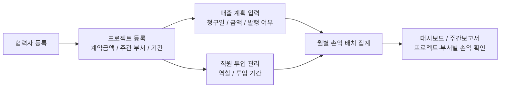
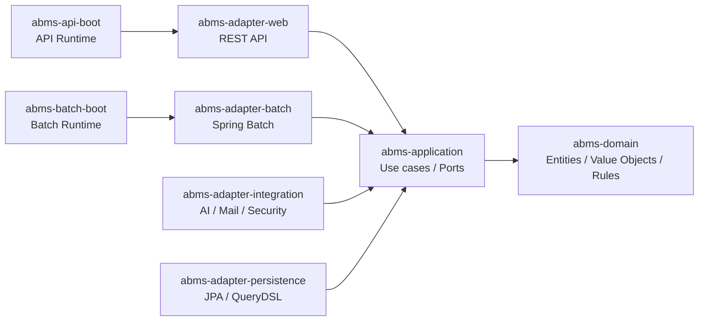
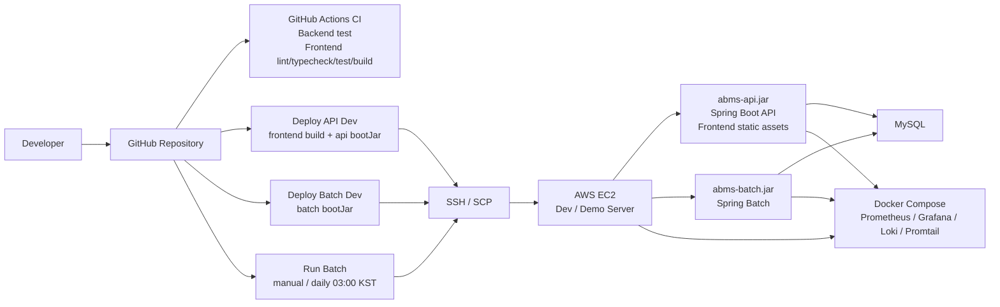
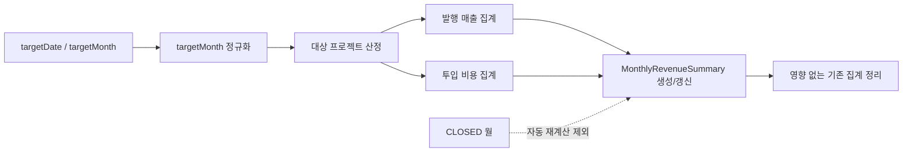
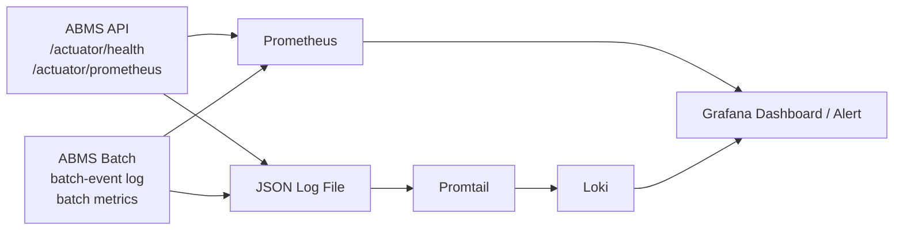

# ABMS

프로젝트 계약 매출과 인력 투입 비용을 연결해 프로젝트/부서별 월별 손익을 산출하는 비즈니스 관리 시스템입니다.

`Java 25` `Spring Boot 4` `Vue 3` `TypeScript` `Hexagonal Architecture` `Spring Batch` `QueryDSL` `MySQL`

기존 Excel 기반 손익 관리의 수작업 계산, 귀속 기준 불일치, 재처리 어려움을 웹 서비스로 전환한 프로젝트입니다. REST API, RDBMS, Batch, AWS EC2 배포, CI/CD, 운영 관측성까지 포함해 운영 가능한 구조를 목표로 설계했습니다.

## 목차

- [프로젝트 개요](#프로젝트-개요)
- [프로젝트에서 보여주는 역량](#프로젝트에서-보여주는-역량)
- [주요 기능](#주요-기능)
- [대표 사용자 흐름](#대표-사용자-흐름)
- [화면 미리보기](#화면-미리보기)
- [핵심 업무 규칙](#핵심-업무-규칙)
- [아키텍처](#아키텍처)
- [인프라/배포 아키텍처](#인프라배포-아키텍처)
- [배치 처리](#배치-처리)
- [기술 스택](#기술-스택)
- [품질 관리](#품질-관리)
- [API 문서화](#api-문서화)
- [운영 관측성](#운영-관측성)
- [실행 방법](#실행-방법)
- [배운 점과 개선 방향](#배운-점과-개선-방향)

## 프로젝트 개요

ABMS는 기존에 Excel 중심으로 관리되던 프로젝트 매출, 인력 투입, 부서별 손익 데이터를 하나의 시스템으로 통합하기 위해 만든 프로젝트입니다.

Excel 기반 관리는 초기에는 빠르게 시작할 수 있지만, 데이터가 늘어날수록 아래 문제가 발생합니다.

- 프로젝트별 계약 매출과 실제 청구 시점 관리가 분리됨
- 직원 투입 기간과 비용 계산을 수작업으로 반복해야 함
- 프로젝트 주관 부서 기준의 손익 귀속을 일관되게 유지하기 어려움
- 월별 집계, 재처리, 마감 여부를 추적하기 어려움
- 권한, 이력, 엑셀 반출입 같은 운영 통제가 부족함

ABMS는 이 문제를 해결하기 위해 **청구 기준 매출**, **투입 MM 기반 비용**, **프로젝트 주관 부서 귀속**이라는 업무 규칙을 도메인 모델로 분리하고, API/Batch/Frontend를 독립적으로 확장할 수 있는 구조로 설계했습니다.

## 프로젝트에서 보여주는 역량

| 요구 역량 | ABMS에서 구현한 내용 |
|---|---|
| Java 백엔드 개발 | Java 25와 Spring Boot 4 기반 REST API, Batch 런타임 구현 |
| REST API 설계 | Web Adapter와 Application Use Case를 분리하고 Spring REST Docs로 API 계약 문서화 |
| RDBMS 데이터 처리 | MySQL, JPA, QueryDSL 기반 검색, 집계, 권한 범위 데이터 처리 |
| 운영 중인 서비스 개선/안정화 | Health Check, JSON 로그, 업무 메트릭, 배치 실패 추적 구조 구성 |
| 클라우드/배포 구조 이해 | AWS EC2 개발/데모 서버, GitHub Actions, SSH/SCP 기반 배포 흐름 구성 |
| CI/CD와 Docker | GitHub Actions 검증/배포 워크플로우, Docker Compose 기반 MySQL 및 관측성 스택 |
| 인증/인가 이해 | 세션 기반 인증, CSRF, 권한 그룹과 scope 기반 기능 접근 제어 |
| 문서 및 산출물 관리 | 요구사항, 도메인 모델, 테스트 가이드, 권한 가이드, 운영 관측성 플레이북 관리 |

## 주요 기능

| 영역 | 기능 |
|---|---|
| 조직 관리 | 직원, 부서, 직급, 재직 상태, 부서 리더 관리 |
| 권한 관리 | 권한 그룹, 권한 범위, 계정별 그룹 할당 관리 |
| 프로젝트 관리 | 협력사, 프로젝트 기간, 계약금액, 주관 부서 관리 |
| 매출 관리 | 프로젝트별 차수 매출 계획, 청구일, 발행 여부 관리 |
| 투입 관리 | 직원별 프로젝트 투입 기간과 역할 관리 |
| 손익 집계 | 월별 매출, 비용, 이익을 프로젝트/부서 기준으로 집계 |
| 리포트 | 대시보드와 주간보고서 화면을 통한 운영 현황 확인 |
| 부가 기능 | Excel 가져오기/내보내기, AI Assistant 기반 직원/부서/프로젝트 자연어 조회 |

## 대표 사용자 흐름



운영자는 프로젝트 계약 정보를 등록한 뒤 매출 계획과 투입 인력을 관리합니다. 이후 배치가 월별 매출과 비용을 집계하고, 대시보드와 리포트 화면에서 프로젝트/부서별 손익을 확인합니다.

## 화면 미리보기

### 대시보드


월별 매출, 비용, 이익 흐름과 주요 운영 지표를 확인하는 화면입니다.

### 직원 관리


직원 기본 정보, 소속 부서, 재직 상태, 직급/등급, 급여 이력을 관리하고 권한 범위에 따라 조회·수정·엑셀 반출입을 제어합니다.

### 프로젝트 관리


계약금액, 프로젝트 기간, 주관 부서, 협력사 정보를 관리하고 매출 계획과 투입 관리로 이어지는 핵심 화면입니다.

프로젝트 진행 상황과 운영 보고 내용을 주간 단위로 관리하는 화면입니다.

### 조직 및 협력사 관리

| 부서 | 협력사 |
|---|---|
|  |  |

부서 구조와 협력사 정보를 별도로 관리해 프로젝트 주관 부서와 고객사/파트너 데이터를 재사용할 수 있도록 구성했습니다.

### 권한 및 계정 설정

| 권한 관리 | 계정 설정 |
|---|---|
|  |  |

권한 그룹과 scope를 기반으로 직원 상세, 프로젝트 관리, 엑셀 반출입 같은 기능 접근을 제어합니다.

### AI Assistant

[AI Assistant 프로젝트 검색 데모](https://github.com/user-attachments/assets/186f3e48-77aa-400c-9124-df09769b0e32)

직원, 부서, 프로젝트 데이터를 자연어로 조회하는 내부 운영 보조 기능입니다.

### 주간보고서


## 핵심 업무 규칙

### 매출 인식

매출은 프로젝트 기간을 월할 계산하지 않고, **세금계산서 발행 여부와 청구 예정일**을 기준으로 인식합니다.

- `ProjectRevenuePlan.revenueDate`가 속한 월에 매출 반영
- `isIssued = true`인 청구 계획만 집계
- 프로젝트 종료 후 발행된 잔금도 청구일이 속한 월의 매출로 집계
- 청구 계획이 없는 월은 매출 0원으로 처리

### 비용 산정

비용은 직원의 월 기본급과 프로젝트 투입 MM을 기준으로 계산합니다.

```text
월 투입 비용 = (월 기본급 * 투입 MM) * (1 + 제경비율 + 판관비율)
```

- 정직원, 프리랜서, 외주 등 직원 유형별 비용 정책 적용
- 투입 기간을 월 단위 MM으로 환산
- 현재는 총 일수 기준의 일할 계산을 사용
- 향후 영업일 기준 MM 계산으로 확장 가능

### 손익 귀속

손익은 직원 소속 부서가 아니라 **프로젝트 주관 부서**에 귀속됩니다.

- 타 부서 직원이 지원 투입되어도 비용은 프로젝트 주관 부서에 반영
- 프로젝트별 손익과 부서별 손익을 같은 기준으로 집계
- Excel 수작업 집계에서 발생하기 쉬운 귀속 기준 불일치를 줄임

## 아키텍처

ABMS 백엔드는 헥사고날 아키텍처와 Gradle 멀티모듈 구조를 기반으로 합니다. 도메인 규칙을 외부 기술에서 분리하고, Web/Persistence/Integration/Batch 어댑터가 애플리케이션 포트를 통해 도메인 유스케이스를 호출합니다.



| 모듈 | 책임 |
|---|---|
| `abms-domain` | 엔티티, 값 객체, 도메인 규칙 |
| `abms-application` | 유스케이스, inbound/outbound port, 애플리케이션 DTO |
| `abms-adapter-web` | REST API, HTTP 요청/응답 DTO, 보안 경계 |
| `abms-adapter-persistence` | JPA, QueryDSL 기반 영속성 어댑터 |
| `abms-adapter-integration` | 메일, 캐시, AI, 보안 서비스 등 외부 통합 |
| `abms-adapter-batch` | Spring Batch Job/Step |
| `abms-api-boot` | API 애플리케이션 조립 및 실행 |
| `abms-batch-boot` | Batch 애플리케이션 조립 및 실행 |
| `frontend` | Vue 3 프론트엔드 |

### 설계 포인트

- 의존성 방향은 `adapter -> application -> domain`으로 제한
- `domain`은 Spring, JPA, Web 계층에 의존하지 않음
- `application`의 outbound port는 Spring Data 타입을 상속하지 않음
- API 런타임과 Batch 런타임을 분리해 배치 자동 실행 설정 충돌을 방지
- ArchUnit 테스트로 계층 의존성 규칙을 검증

## 인프라/배포 아키텍처

개발/데모 서버 배포는 GitHub Actions에서 빌드한 산출물을 AWS EC2 서버에 SSH/SCP로 업로드하고, 서버에서 Java 프로세스와 Docker Compose 기반 관측성 스택을 실행하는 구조입니다.



### 배포 흐름

- PR/브랜치 검증은 `CI` 워크플로우에서 백엔드 테스트와 프론트엔드 검증을 수행
- API 배포 시 프론트엔드 빌드 결과를 `abms-api-boot` 정적 리소스로 복사한 뒤 `abms-api.jar` 생성
- Batch 배포는 `abms-batch.jar`를 별도로 생성해 API 재기동 없이 서버에 반영
- AWS EC2 개발/데모 서버에는 `.env` 기반 환경 변수를 로드해 API/Batch를 `dev` 프로파일로 실행
- 배치 실행은 GitHub Actions에서 수동 실행하거나 매일 03:00 KST에 자동 실행
- 배포 성공 시 선택적으로 `deploy-api-dev-*`, `deploy-batch-dev-*`, `batch-dev-*` 태그 생성

### 운영 구성

- AWS EC2 인스턴스를 개발/데모 서버로 사용
- API와 Batch는 별도 실행 파일로 분리되어 배포와 실행 책임을 나눔
- 프론트엔드는 별도 정적 서버 없이 API Boot JAR의 정적 리소스로 포함
- MySQL은 로컬 개발 기준 Docker Compose로 실행하며, 운영/개발 서버는 환경 변수의 `DB_URL`로 연결
- 관측성 스택은 `ops/observability`를 서버에 업로드한 뒤 Docker Compose로 실행
- 외부 공개 포트와 Actuator 메트릭 접근은 서버 보안 그룹과 `APP_ACTUATOR_ALLOWED_IP_RANGES`로 제한 가능
- API 배포 후 `/actuator/health`와 Prometheus target 상태를 확인해 배포 성공 여부 검증

## 배치 처리

`revenueMonthlySummaryJob`은 프로젝트별 월별 손익 현재값을 집계하는 Spring Batch 작업입니다.



핵심 처리 규칙은 다음과 같습니다.

- `targetDate`가 있으면 해당 날짜가 속한 월로 정규화
- `targetMonth=yyyyMM` 파라미터로 특정 월 수동 재처리 가능
- 대상 월과 기간, 매출, 투입, 기존 집계 중 하나라도 관련 있는 프로젝트를 집계 대상으로 선정
- `(projectId, targetMonth)` 기준으로 생성 또는 갱신해 중복 집계를 방지
- 원천 데이터가 사라져 더 이상 영향을 주지 않는 기존 집계는 삭제
- `CLOSED` 월은 자동 배치 재계산 대상에서 제외

## 기술 스택

### Backend

- Java 25
- Spring Boot 4
- Spring Data JPA
- QueryDSL
- Spring Batch
- Spring AI
- MySQL
- Gradle Kotlin DSL

### Frontend

- Vue 3
- TypeScript
- Vite
- Pinia
- Vue Router
- TailwindCSS
- Reka UI
- TanStack Vue Table

### Quality & Tools

- JUnit 5
- AssertJ
- Mockito
- Spring Test
- ArchUnit
- Spring REST Docs
- Asciidoctor
- JSpecify
- Error Prone
- NullAway
- Vitest
- Playwright

### Observability

- Spring Boot Actuator
- Micrometer
- Prometheus
- Grafana
- Loki
- Promtail

### Infra & CI/CD

- AWS EC2
- GitHub Actions
- Docker Compose
- SSH/SCP deployment
- MySQL

## 품질 관리

ABMS는 업무 규칙이 많은 프로젝트이기 때문에 기능 테스트뿐 아니라 아키텍처 규칙과 정적 분석을 함께 사용합니다.

- 도메인 값 객체와 엔티티 규칙을 단위 테스트로 검증
- API/Batch 부트 모듈에서 통합 테스트 수행
- ArchUnit으로 헥사고날 아키텍처 의존성 규칙 검증
- Spring REST Docs로 테스트 기반 API 문서 생성
- JSpecify 어노테이션과 NullAway를 함께 사용해 null 안정성 강화
- Error Prone으로 컴파일 단계 정적 분석 수행
- 프론트엔드는 lint, typecheck, unit test, e2e test 스크립트 제공

```bash
# Backend
./gradlew test

# Frontend
cd frontend
npm run lint
npm run typecheck
npm run test:unit
npm run test:e2e
```

## API 문서화

API 문서는 Spring REST Docs와 Asciidoctor를 사용해 테스트 결과에서 생성합니다. 요청/응답 예시와 필드 설명이 테스트 스니펫에서 만들어지기 때문에, API 계약이 변경되면 문서도 함께 갱신됩니다.

```bash
./gradlew :abms-api-boot:asciidoctor
```

생성된 문서는 API Boot JAR의 정적 리소스에 포함됩니다.

- 원본 Asciidoc: `abms-api-boot/src/docs/asciidoc/index.adoc`
- 생성 스니펫: `abms-api-boot/build/generated-snippets`
- 로컬 실행 후 문서 경로: `http://localhost:8080/docs/index.html`

문서화 대상에는 인증, CSRF, 직원, 부서, 프로젝트, 매출 계획, 투입 관리, 대시보드, 월별 손익 요약, 알림, AI 채팅, 공통 오류 응답이 포함됩니다.

## 운영 관측성

ABMS는 API와 Batch 런타임의 상태를 운영 관점에서 확인할 수 있도록 Actuator, Prometheus, Grafana, Loki 기반의 관측성 구성을 제공합니다.



주요 확인 항목은 다음과 같습니다.

- `/actuator/health`, `/actuator/health/readiness` 기반 API 상태 확인
- `/actuator/prometheus`를 통한 JVM, HTTP, 애플리케이션 메트릭 수집
- DB, 메일, OpenAI 연결 상태 Health Indicator 제공
- JSON 로그 기반 `http-access`, `security-event`, `batch-event` 추적
- 인증 실패 수, 배치 실행 수, 마지막 배치 실패 시각 등 업무 지표 기록
- Grafana 대시보드와 Loki 로그 검색으로 장애 원인 추적

로컬 관측성 스택은 다음 명령으로 실행할 수 있습니다.

```bash
cd ops/observability
docker compose up -d
```

관련 문서:

- [Observability Stack](ops/observability/README.md)
- [운영 관측성 플레이북](docs/운영-관측성-플레이북.md)

## 실행 방법

### 요구 사항

- Java 25
- Docker 및 Docker Compose
- Node.js 22 이상
- npm

### 환경 변수

로컬 실행 전 프로젝트 루트에 `.env`를 생성합니다.

```bash
cp .env.example .env
```

주요 환경 변수는 다음과 같습니다.

- `DB_URL`
- `DB_USERNAME`
- `DB_PASSWORD`
- `AI_OPENAI_API_KEY`

### 데이터베이스 실행

```bash
docker compose up -d mysql
```

로컬 MySQL은 `localhost:3307`에서 실행됩니다.

### 백엔드 실행

```bash
# API 런타임
./gradlew bootRun

# Batch 런타임
./gradlew bootRunBatch

# 특정 배치 잡 실행
./gradlew :abms-batch-boot:bootRun --args='--spring.batch.job.name=revenueMonthlySummaryJob'
```

API 서버는 기본적으로 `http://localhost:8080`에서 실행됩니다.

### 프론트엔드 실행

```bash
cd frontend
npm install
npm run dev
```

프론트엔드 개발 서버는 기본적으로 `http://localhost:5173`에서 실행됩니다.

## 주요 개발 명령

### Backend

```bash
./gradlew clean build
./gradlew test
./gradlew :abms-domain:test --tests "kr.co.abacus.abms.domain.shared.MoneyTest"
./gradlew :abms-batch-boot:bootRun --args='--spring.profiles.active=local-batch --spring.batch.job.name=revenueMonthlySummaryJob targetMonth=202602 run.id=manual-202602'
```

### Frontend

```bash
cd frontend
npm run dev
npm run build
npm run lint
npm run typecheck
npm run test:unit
npm run test:e2e
```

## 프로젝트 구조

```text
abms/
├── abms-domain
├── abms-application
├── abms-adapter-web
├── abms-adapter-persistence
├── abms-adapter-integration
├── abms-adapter-batch
├── abms-api-boot
├── abms-batch-boot
├── frontend
└── docs
```

프론트엔드는 기능 단위로 구성되어 있습니다.

```text
frontend/src/
├── core
├── components
├── features
│   ├── admin
│   ├── chat
│   ├── department
│   ├── employee
│   └── project
└── assets
```

## 문서

- [개발 가이드](docs/개발가이드.md)
- [도메인 모델](docs/도메인모델.md)
- [매출관리 요구사항](docs/매출관리_요구사항.md)
- [멀티모듈 전환 핵심](docs/멀티모듈_전환_핵심.md)
- [테스트 가이드](docs/테스트가이드.md)
- [인증 가이드](docs/인증가이드.md)
- [권한 가이드](docs/권한가이드.md)
- [운영 관측성 플레이북](docs/운영-관측성-플레이북.md)

## 배운 점과 개선 방향

### 배운 점

- Excel로 관리되던 업무 규칙은 먼저 계산 기준과 귀속 기준을 명확히 분리해야 시스템화할 수 있음
- 복잡한 손익 규칙은 컨트롤러나 DB 쿼리에 흩뿌리기보다 도메인 모델과 유스케이스로 분리해야 테스트하기 쉬움
- API와 Batch를 별도 부트 모듈로 분리하면 실행 설정과 배포 책임이 명확해짐
- 아키텍처 규칙은 문서화만으로는 유지되기 어렵기 때문에 ArchUnit 같은 테스트로 강제하는 것이 효과적임

### 개선 방향

- 영업일 기준 MM 계산 고도화
- 월 마감/재마감 UI 추가
- 부서별 손익 대시보드 고도화
- 손익 시뮬레이션 기능 확장
- Playwright 기반 주요 사용자 흐름 E2E 테스트 확대
