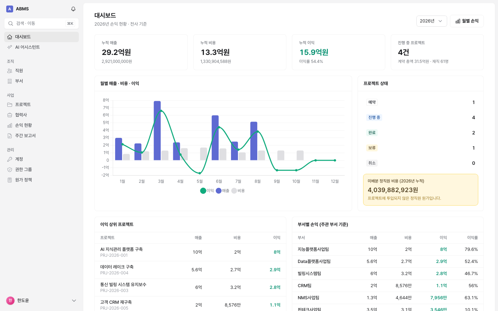
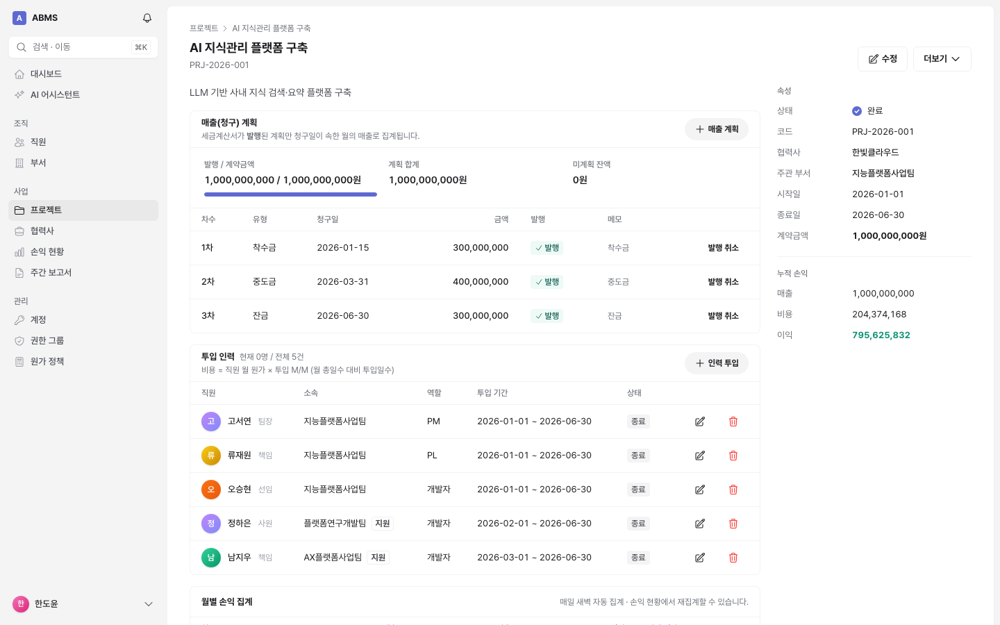
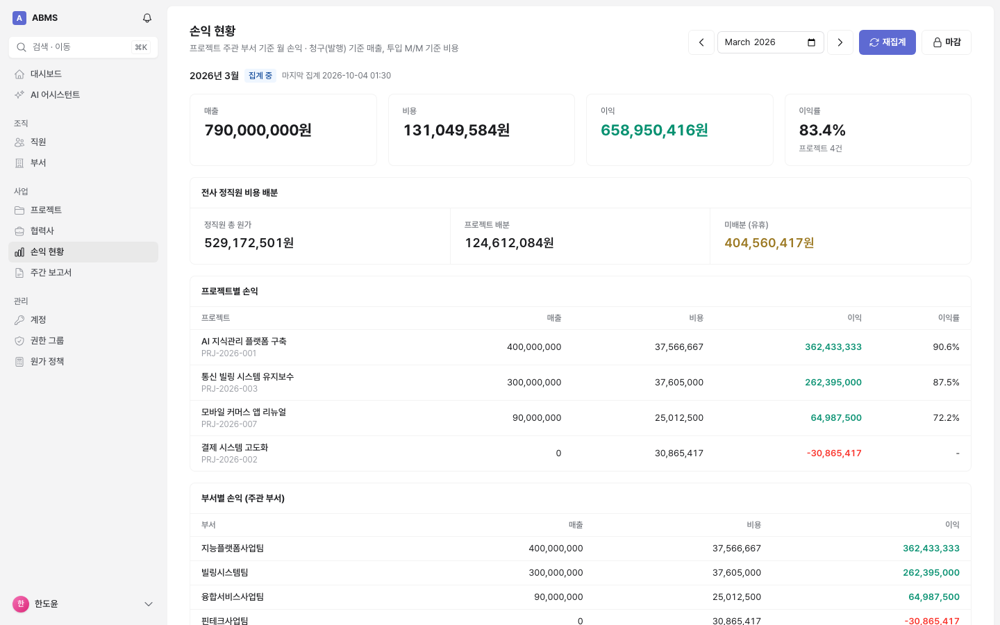
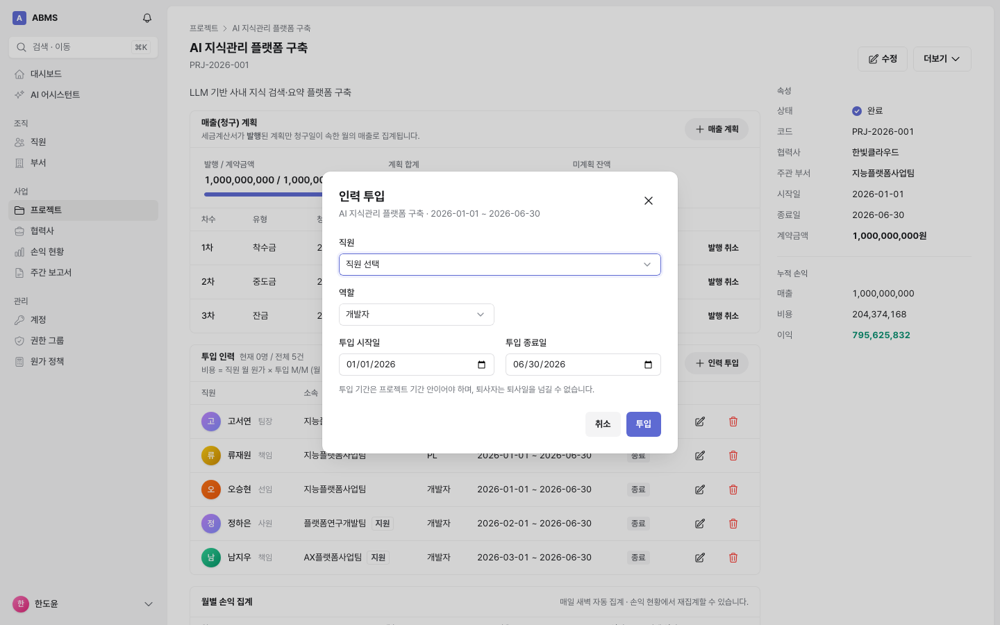
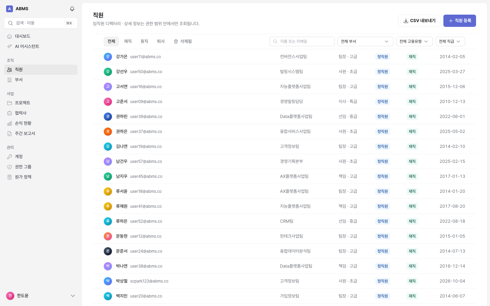
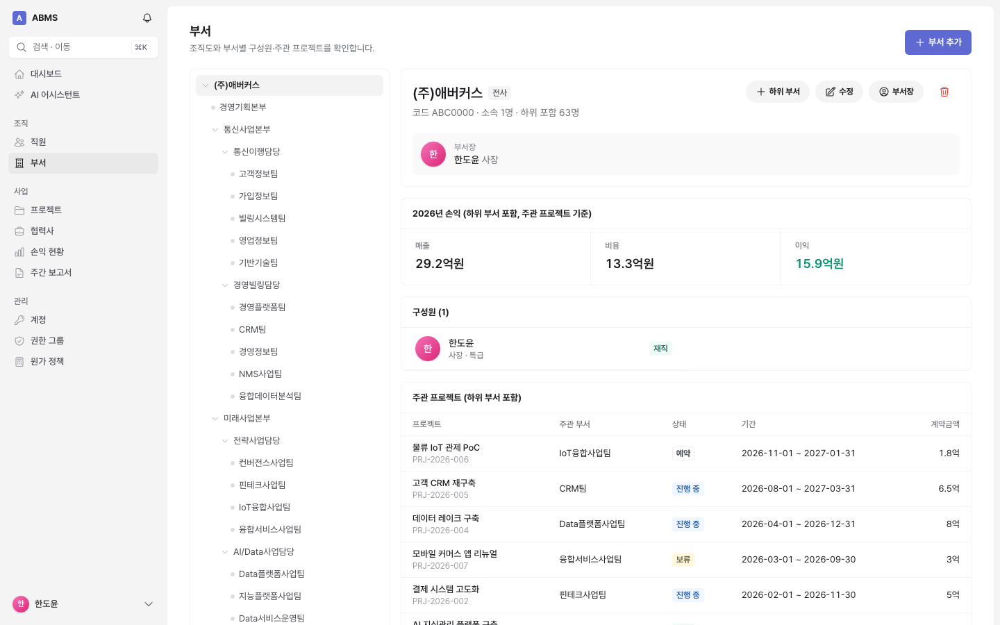
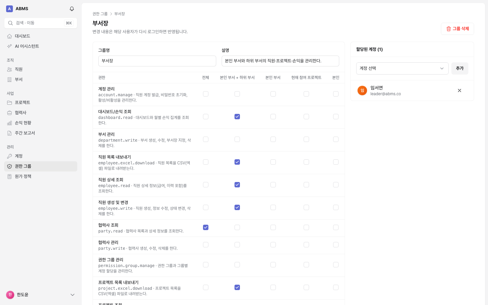
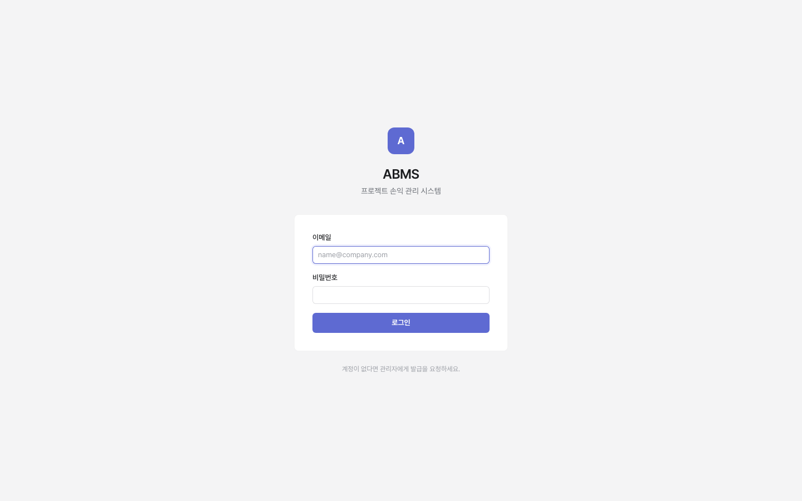
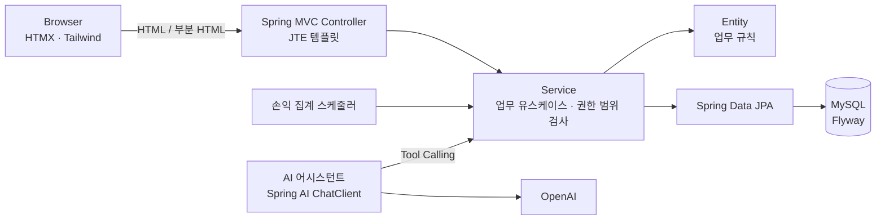

# ABMS v2

> 기존 ABMS(저장소 루트)를 같은 업무 규칙으로 새 기술 스택에 맞춰 다시 만든 프로젝트입니다. 이 폴더만으로 독립 빌드·실행됩니다.

프로젝트 계약 매출과 인력 투입 비용을 연결해 **프로젝트·부서별 월 손익**을 산출하는 비즈니스 관리 시스템입니다.

`Java 25` `Spring Boot 4.1` `Spring Security 7` `Spring Data JPA` `Flyway` `MySQL 8.4`
`Spring AI 2.0` `JTE` `HTMX 2` `Tailwind CSS 4` `SEED Design` `JUnit 5` `Testcontainers`

Excel로 관리하던 손익 계산(수작업 집계, 귀속 기준 불일치, 재처리 어려움)을 웹 서비스로 옮긴 프로젝트입니다.
서버에서 HTML을 렌더링(JTE)하고 HTMX로 부분 갱신하는 **하이퍼미디어 방식**으로, 별도 SPA 빌드 없이 하나의 Spring Boot 애플리케이션으로 동작합니다.

## 목차

- [주요 기능](#주요-기능)
- [화면](#화면)
- [핵심 업무 규칙](#핵심-업무-규칙)
- [기술 스택](#기술-스택)
- [아키텍처](#아키텍처)
- [실행 방법](#실행-방법)
- [설정](#설정)
- [테스트](#테스트)
- [프로젝트 구조](#프로젝트-구조)
- [문서](#문서)

## 주요 기능

| 영역 | 기능 |
|---|---|
| 대시보드 | 연간 누적 매출·비용·이익, 월별 추이 차트, 이익 상위 프로젝트, 부서별 손익, 청구 예정/미발행 매출 |
| 직원 | 디렉터리 검색(실시간 필터), 등록/수정, 휴직·복직·퇴사, 승진, 연봉 이력, 삭제·복구, CSV 내보내기 |
| 부서 | 조직도 트리, 구성원, 부서장 지정, 주관 프로젝트, 부서 손익 |
| 협력사 | 고객사/파트너 관리, 협력사별 프로젝트 |
| 프로젝트 | 계약·기간·주관 부서 관리, 매출(청구) 계획과 세금계산서 발행 처리, 투입 인력 관리, 월별 손익 이력, CSV 내보내기 |
| 손익 현황 | 월별 프로젝트·부서 손익, 전사 정직원 비용 배분(미배분 유휴 비용), 수동 재집계, 월 마감/해제 |
| 주간 보고서 | 프로젝트 현황·청구·인력 변화 스냅샷으로 보고서 초안 생성 (AI 또는 템플릿), 편집 |
| AI 어시스턴트 | 직원·부서·프로젝트·손익을 자연어로 질의 (Spring AI Tool Calling, 사용자 권한 범위 내 조회, 대화 기록 저장) |
| 관리 | 계정 발급(임시 비밀번호)·잠금 해제, 권한 그룹(권한 × 범위 매트릭스), 원가 정책 |
| 알림 | 프로젝트 투입, 계정 발급 등 알림 |

## 화면

| 대시보드 | 프로젝트 상세 (매출 계획 · 투입 인력 · 월별 손익) |
|---|---|
|  |  |
| **손익 현황 (월별 · 전사 비용 배분)** | **HTMX 모달 폼** |
|  |  |
| **직원 디렉터리** | **조직도** |
|  |  |
| **권한 그룹 (권한 × 범위)** | **로그인** |
|  |  |

## 핵심 업무 규칙

```text
직원 월 원가   = 연봉 ÷ 12 × (1 + 제경비율 + 판관비율)          ← 연도·고용유형별 원가 정책
프로젝트 매출  = Σ 해당 월 청구일 & 세금계산서 발행된 매출 계획
프로젝트 비용  = Σ 투입 직원 월 원가 × 투입 M/M                 ← 월 총일수 대비 투입일수
손익 귀속      = 직원 소속 부서가 아닌 프로젝트 "주관 부서"
```

- 매출은 기간 월할이 아니라 **청구(발행) 기준**으로 인식합니다. 미발행 계획은 집계하지 않습니다.
- 손익은 매일 03:00(KST) 전월·당월을 **멱등하게 재집계**하며, 화면에서 즉시 재집계할 수 있습니다.
- **마감된 월**은 재집계하지 않고, 그 월의 손익을 바꾸는 원천 데이터(발행, 투입, 연봉, 원가 정책 등) 변경도 막습니다. 정정이 필요하면 마감 해제 → 수정 → 재마감합니다.
- 급여·원가 정책이 누락된 직원은 집계 결과에 경고로 표시합니다.

자세한 규칙: [매출관리 요구사항](docs/매출관리_요구사항.md), [도메인 모델](docs/도메인모델.md)

## 기술 스택

| 구분 | 기술 |
|---|---|
| Language / Runtime | Java 25, 가상 스레드 |
| Framework | Spring Boot 4.1 (Web MVC), Spring Security 7, Spring Data JPA (Hibernate 7), Bean Validation |
| Database | MySQL 8.4, Flyway (스키마/기준 데이터/데모 데이터 마이그레이션) |
| AI | Spring AI 2.0 (OpenAI), Tool Calling, JPA 기반 ChatMemoryRepository |
| View | JTE (컴파일 타임 타입 검사 템플릿), HTMX 2, Tailwind CSS 4, [SEED Design](https://seed-design.io) (토큰·컴포넌트 CSS), Chart.js, marked |
| Test | JUnit 5, AssertJ, Spring MockMvc, Spring Security Test, Testcontainers (MySQL) |
| Build / CI | Gradle (Kotlin DSL), npm(Tailwind CLI), GitHub Actions |

## 아키텍처



### 설계 포인트

- **기능 단위 패키지**: `employee`, `project`, `summary` … 각 패키지에 엔티티·리포지토리·서비스·컨트롤러가 함께 있습니다.
- **풍부한 엔티티**: 상태 전이와 검증(퇴사일, 투입 기간, 승진 규칙 등)을 엔티티가 직접 책임집니다.
- **권한 = 코드 × 범위**: `AccessService`가 권한 범위(전체/부서 트리/부서/참여/본인)를 `DataScope`로 해석하고, 서비스 계층에서 일관되게 적용합니다. AI 어시스턴트 도구도 같은 서비스를 거쳐 권한 범위를 벗어나지 않습니다.
- **하이퍼미디어 UI**
  - `hx-boost`로 페이지 이동, 검색 폼은 결과 영역만 부분 갱신하고 URL을 갱신(`hx-push-url`)
  - 모달 폼은 검증 실패 시 `422`로 폼을 다시 그리고, 성공 시 `HX-Retarget`으로 해당 섹션만 갱신하거나 `HX-Redirect` + flash 토스트로 이동
  - 업무 규칙 위반은 `HX-Trigger` 토스트 이벤트로 알림 (한글은 JSON 유니코드 이스케이프)
  - 세션 만료 시 HTMX 요청에는 `HX-Redirect: /login`으로 응답
- **JTE 사전 컴파일**: 템플릿이 Java 코드로 생성·컴파일되어 모델 타입 오류를 빌드 시점에 잡습니다.
- **SEED 디자인 시스템**: `@seed-design/css`의 토큰과 컴포넌트 CSS를 React 없이 사용합니다.
  - 버튼·뱃지·Callout·Snackbar·Side Navigation은 SEED 레시피 클래스를 그대로 쓰고, 템플릿에서는 `Seed` 헬퍼(`${Seed.button("brandSolid")}`)로 클래스 이름을 만듭니다.
  - 카드·표·입력 필드처럼 SEED에 없거나 React 상태가 필요한 요소는 `src/main/tailwind/app.css`에서 SEED 토큰(`bg-bg-layer-default`, `text-fg-neutral`, `p-x4`, `t4-bold` …)으로 정의합니다.
  - 색은 역할 토큰만 사용합니다. `linear-theme.css`가 SEED 토큰 값을 Linear 풍(무채색·인디고 강조·13px 밀도)으로 덮어쓰며, 라이트/다크/시스템 테마를 사용자 메뉴에서 전환합니다.
- **키보드 중심 UX**: `⌘K`(Ctrl+K) 명령 팔레트로 화면 이동·생성·테마 전환과 직원/프로젝트/부서/협력사 검색을 합니다(`/palette`, 권한 범위 유지). `G` → `P` 같은 이동 단축키, `/` 검색, `C` 새로 만들기, `?` 도움말을 지원합니다.
- **소프트 삭제 + 고유성**: 생성 컬럼(`CASE WHEN deleted = 0 THEN code END`)에 유니크 인덱스를 걸어 삭제 후 같은 코드/이름 재사용을 허용합니다.

## 실행 방법

### 요구 사항

- JDK 25
- Node.js 22+ (Tailwind CSS 빌드)
- Docker (로컬 MySQL, 테스트용 Testcontainers)

### 로컬 실행 (데모 데이터 포함)

```bash
./gradlew bootRun
```

- `local` 프로필이 기본이며, `compose.yaml`의 MySQL(3308 포트)을 **Spring Boot Docker Compose 지원으로 자동 기동**합니다.
- Flyway가 스키마와 기준 데이터, 데모 데이터(`db/demo`)를 적용하고, 기동 시 최근 15개월 손익을 집계합니다.
- http://localhost:8080 에 접속해 데모 계정으로 로그인합니다. (비밀번호 `abms1234!`)

| 계정 | 권한 |
|---|---|
| `admin@abms.co` | 최고 관리자 (전체) |
| `leader@abms.co` | 부서장 – AI/Data사업담당 및 하위 부서 범위 |
| `member@abms.co` | 일반 사용자 – 본인 정보, 참여 프로젝트 |

> 데모 데이터의 인물·회사는 모두 가상입니다.

### 화면 개발

`local` 프로필은 JTE 개발 모드로 템플릿 변경이 즉시 반영됩니다. CSS는 별도 터미널에서 감시 빌드를 켜 둡니다.

```bash
npm install
npm run watch:css
```

### 운영 빌드

```bash
./gradlew bootJar          # build/libs/abms.jar
java -jar build/libs/abms.jar --spring.profiles.active=prod
```

`local`/`demo`가 아닌 프로필은 데모 데이터를 적용하지 않습니다. 처음 기동할 때 `ABMS_ADMIN_EMAIL`, `ABMS_ADMIN_PASSWORD`를 지정하면 최고 관리자 계정이 생성됩니다.

## 설정

| 환경 변수 | 설명 | 기본값 |
|---|---|---|
| `DB_URL` / `DB_USERNAME` / `DB_PASSWORD` | MySQL 접속 정보 | `jdbc:mysql://localhost:3308/abms` / `abms` / `abms` |
| `OPENAI_API_KEY` | AI 어시스턴트·AI 주간 보고서. 미설정 시 어시스턴트는 안내 메시지, 보고서는 템플릿으로 생성 | (없음) |
| `OPENAI_MODEL` | 사용할 모델 | `gpt-4.1-mini` |
| `ABMS_ADMIN_EMAIL` / `ABMS_ADMIN_PASSWORD` | 계정이 하나도 없을 때 생성할 최고 관리자 | (없음) |

| 프로퍼티 | 설명 | 기본값 |
|---|---|---|
| `abms.summary.schedule-enabled` | 매일 손익 재집계 실행 여부 | `true` |
| `abms.summary.cron` | 재집계 시각 (Asia/Seoul) | `0 0 3 * * *` |

## 테스트

```bash
./gradlew test
```

Docker가 필요합니다. 통합 테스트는 Testcontainers로 MySQL 8.4를 띄워 **실제 Flyway 마이그레이션과 Hibernate 스키마 검증**을 거친 뒤 실행되며, 모든 통합 테스트가 하나의 컨텍스트·컨테이너를 공유하고 테스트마다 롤백됩니다.

| 구분 | 내용 |
|---|---|
| 도메인 단위 테스트 | 금액·기간 값 객체, 직원 상태 전이, 투입 M/M 계산, 원가 정책, 부서 트리, 권한 범위 |
| 서비스 통합 테스트 | 손익 집계(청구 기준 매출, M/M 비용, 주관 부서 귀속, 멱등성, 마감, 미배분 비용), 권한 범위별 직원/프로젝트 접근, 매출 계획 규칙, 중복 투입 금지 |
| 웹 테스트 (MockMvc) | 로그인·계정 잠금, CSRF, 권한별 403, HTMX 응답 헤더(`HX-Redirect`, `HX-Retarget`, `HX-Trigger`), 폼 검증 422, CSV, 주요 화면 렌더링 |
| AI | 어시스턴트 도구의 권한 범위 준수, 대화 메모리 저장소 |

## 프로젝트 구조

```text
src/main/java/kr/co/abacus/abms
├── common          # BaseEntity, Money, Period, HTMX 도우미, 공통 예외/뷰 모델
├── security        # Spring Security 설정, LoginUser, 권한 범위 해석(AccessService)
├── access          # 권한, 권한 그룹, 그룹 권한/계정 할당
├── account         # 계정, 로그인, 내 정보, 계정 관리, 초기 관리자 생성
├── department      # 부서, 조직도 트리
├── employee        # 직원, 연봉/직급 이력
├── party           # 협력사
├── project         # 프로젝트, 매출 계획, 투입 인력
├── summary         # 원가 정책, 월 손익 집계/조회, 마감, 스케줄러
├── dashboard       # 대시보드
├── report          # 주간 보고서
├── assistant       # AI 어시스턴트 (Spring AI)
└── notification    # 알림
src/main/jte        # JTE 템플릿 (layout, components, 기능별 화면)
src/main/tailwind   # Tailwind CSS 소스 (SEED 토큰·컴포넌트 import)
src/main/resources
├── db/migration    # V1 스키마, V2 기준 데이터 (권한, 시스템 그룹, 원가 정책)
├── db/demo         # 데모 데이터 (local/demo 프로필)
└── static/js       # HTMX 확장 동작 (토스트, 모달, 차트, 마크다운)
```

## 서드파티 라이선스

- UI는 당근의 [SEED Design](https://github.com/daangn/seed-design)(`@seed-design/css`, `@seed-design/tailwind4-theme`, Apache License 2.0)을 사용합니다. 빌드된 `static/css/app.css`에 SEED CSS가 포함되며, 원본 저작권 고지와 라이선스는 각 패키지의 `LICENSE`, `NOTICE`를 따릅니다. 당근 로고·브랜드 자산은 사용하지 않습니다.
- 아이콘은 [Heroicons](https://heroicons.com)(MIT)를 사용합니다.

## 문서

- [도메인 모델](docs/도메인모델.md)
- [권한 가이드](docs/권한가이드.md)
- [매출관리 요구사항](docs/매출관리_요구사항.md)
- [용어사전](../docs/용어사전.md)
- [커밋 컨벤션](../docs/커밋-컨벤션.md)
