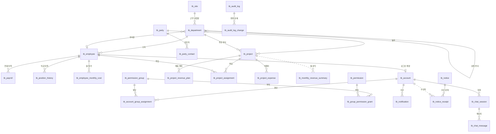
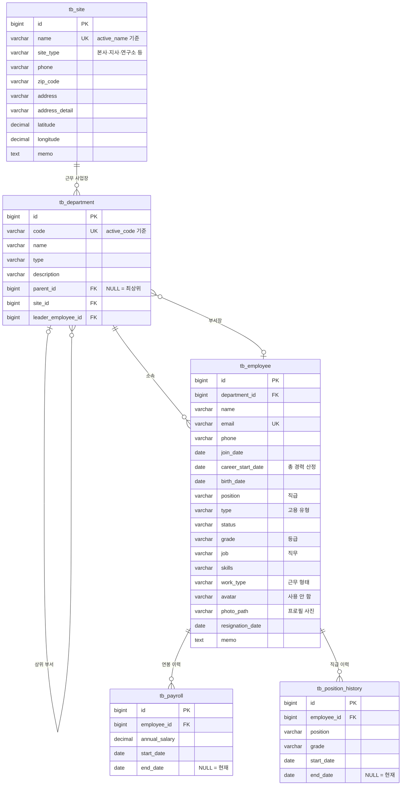
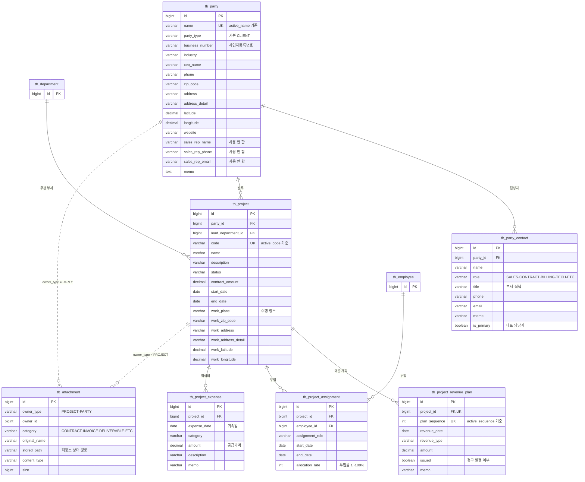
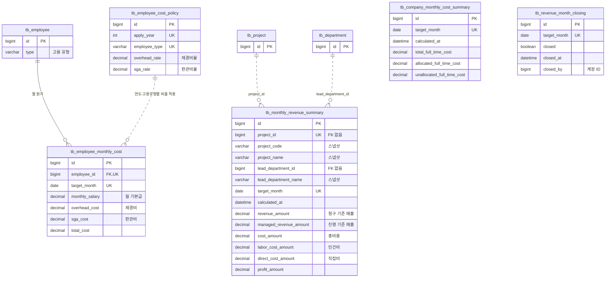
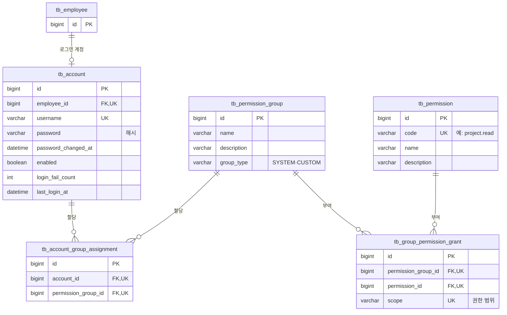
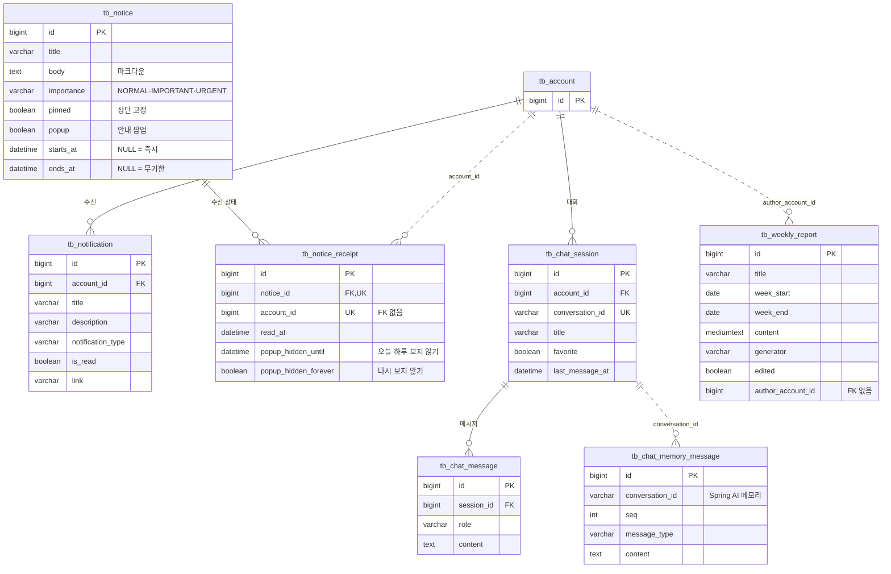
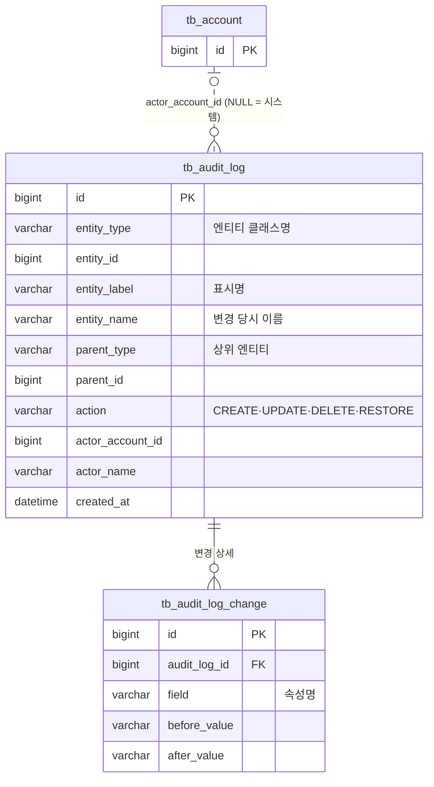

# ABMS v2 ERD

`abms-v2/src/main/resources/db/migration` 의 Flyway 마이그레이션(V1~V11)을 모두 적용한 뒤의 스키마를 그린 문서입니다.
스키마의 기준은 마이그레이션 SQL이므로, 테이블이나 컬럼을 바꾸는 마이그레이션을 추가할 때 이 문서도 함께 고쳐 주세요.

## 읽는 법

- **실선**(`──`)은 DB에 실제 FK 제약이 걸린 관계이고, **점선**(`┄┄`)은 FK 없이 ID 값으로만 참조하는 논리적 관계입니다.
- 공통 컬럼은 다이어그램에서 생략했습니다. 아래 표에 정리되어 있습니다.
- `PK`, `FK`, `UK`(유니크) 표시가 붙어 있고, `UK`는 복합 유니크의 구성 컬럼에도 붙어 있습니다.

### 공통 컬럼 (감사·소프트 삭제)

`tb_audit_log`, `tb_audit_log_change`, `tb_chat_memory_message`, `tb_notice_receipt` 를 뺀 모든 테이블에 있습니다.

| 컬럼 | 타입 | 설명 |
| --- | --- | --- |
| `created_at` / `updated_at` | `DATETIME(6)` | 생성·수정 시각 |
| `created_by` / `updated_by` | `BIGINT` NULL | 생성·수정한 계정(`tb_account.id`), 시스템 작업이면 NULL |
| `deleted` | `BOOLEAN` | 소프트 삭제 여부 |
| `deleted_at` / `deleted_by` | `DATETIME(6)` / `BIGINT` NULL | 삭제 시각·삭제한 계정 |

### `active_*` 생성 컬럼

`tb_department.active_code`, `tb_project.active_code`, `tb_party.active_name`, `tb_site.active_name`, `tb_project_revenue_plan.active_sequence` 는
`deleted = 0` 일 때만 값을 갖는 STORED 생성 컬럼입니다. 여기에 유니크 제약을 걸어, 삭제된 행과는 코드나 이름이 겹쳐도 되도록 했습니다.

---

## 1. 전체 관계도

테이블 사이의 관계만 보여 주는 지도입니다. 컬럼은 아래 도메인별 다이어그램에서 볼 수 있습니다.

관계선이 없는 테이블은 아래와 같습니다. 단독으로 쓰이거나, ID나 다형 키로만 참조합니다.

| 테이블 | 참조 방식 |
| --- | --- |
| `tb_employee_cost_policy` | `tb_employee.type` 과 적용 연도로 조회 |
| `tb_company_monthly_cost_summary` | 월(`target_month`) 단위 전사 집계 |
| `tb_revenue_month_closing` | 월 단위 마감, `closed_by` 는 계정 ID |
| `tb_weekly_report` | `author_account_id` 는 계정 ID |
| `tb_attachment` | `owner_type`(PROJECT / PARTY) + `owner_id` 다형 참조 |
| `tb_audit_log` | `entity_type` + `entity_id` 다형 참조, `actor_account_id` 는 계정 ID |
| `tb_chat_memory_message` | `conversation_id` 로 `tb_chat_session` 과 연결 (Spring AI 메모리) |

---

## 2. 조직·인사

---

## 3. 협력사·프로젝트

---

## 4. 원가·손익 집계

손익 집계 테이블은 FK 없이 프로젝트와 부서의 ID, 코드, 이름을 **집계 시점 값으로 복사해** 저장합니다.
원본이 바뀌거나 삭제되어도 마감된 월의 숫자가 유지되도록 하기 위해서입니다.

---

## 5. 계정·권한

권한은 `계정 → 권한 그룹 → (권한, 범위)` 구조입니다. 자세한 규칙은 [권한가이드](권한가이드.md)를 참고하세요.

---

## 6. 커뮤니케이션 (알림·공지·AI 어시스턴트·주간 보고서)

---

## 7. 감사 로그

엔티티 변경 이력을 남깁니다. `tb_audit_log` 하나가 변경 이벤트 하나이고, `tb_audit_log_change` 에 속성별 이전 값과 이후 값이 들어갑니다.

